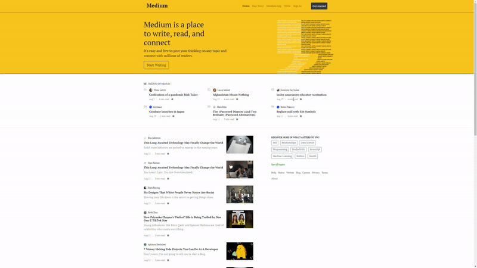

## Bootstrap Medium Klon Çalışması


 

Patika.dev ile bu Projede; Bootstrap ile Medium benzeri bir sitenin nasıl oluşturulabileceğine dair bir çalışma yaptık.



Bu repo [Kodluyoruz](https://www.kodluyoruz.org/) Front-End Eğitiminde oluşturduğum bootstrap alıştırma eğitimi. İçerisinde bir README, bir .html, fontawesome dosya, Js. dosya ve Boostrap dosyaları barındırıyor.

## Installation

Öncelikle projeyi clonelayın.

```
https://github.com/Mucahid-Canbey/Bootstrap-Medium-Klon-Calismasi.git
```

## Usage
Projeyi cloneladıktan sonra Visual Studio Code programında açınız.

Linux için:
```
cd kodluyoruzilkrepo
code .
```
## Contributing
Pull requestler kabul edilir. Büyük değişiklikler için, lütfen önce neyi değiştirmek istediğinizi tartışmak için bir konu açınız.

## License
[MIT](https://choosealicense.com/licenses/mit/)
